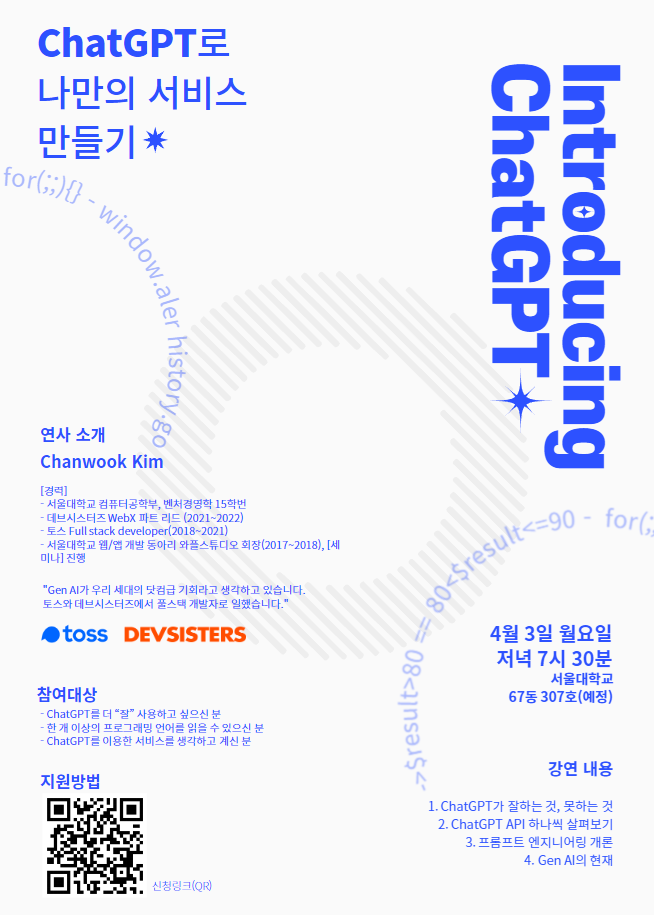

# ChatGPT-seminar



ChatGPT로 나만의 서비스 만들기 세미나 자료 repository입니다.

## 강연자료
[seminar.pdf](./seminar.pdf) 를 참고해주세요.

## 실행방법
Python 3.8 이상 버전을 설치하고, 편한 방식대로 requirements.txt를 설치한 뒤 `python (파일명)` 으로 실행합니다.
```shell
pip install -r requirements.txt
python 01_initialize.py
```